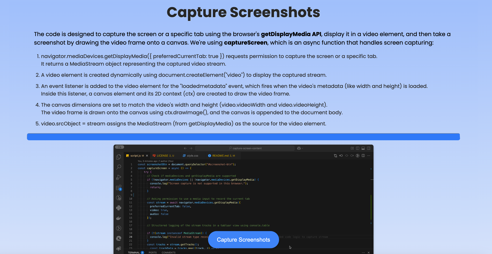

# Capturing Screen Content

The code is designed to capture the screen or a specific tab using the browser's getDisplayMedia API, display it in a video element, and then take a screenshot by drawing the video frame onto a canvas.

## License

This project is licensed under the MIT License - see the [LICENSE](LICENSE) file for details.

## Visuals

## Contact

Maintained by tpreisig - feel free to reach out!
